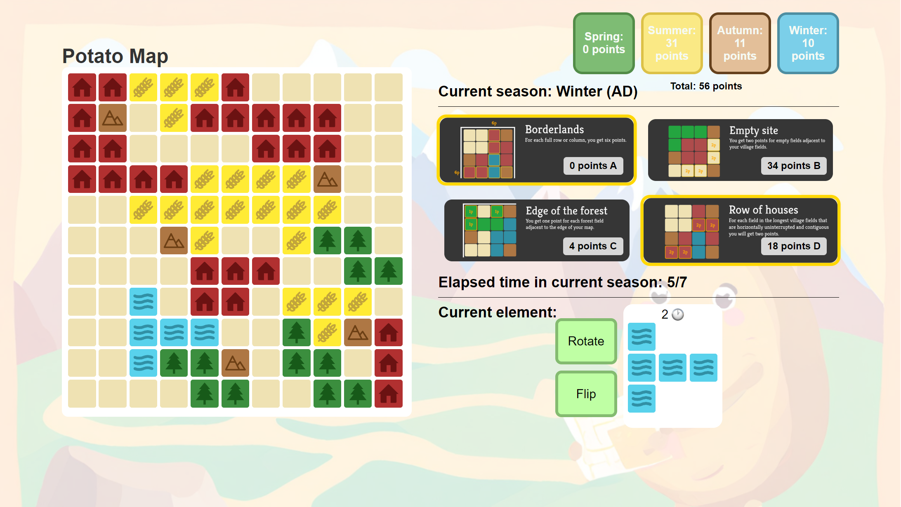
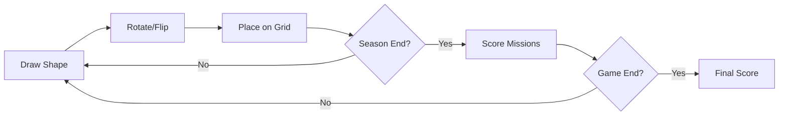

# The Mapmaker

A browser-based tile-placement strategy game where players place terrain elements on an 11×11 grid across four seasons, scoring points based on randomly selected mission objectives.


## Overview

The Mapmaker is a single-player strategy game inspired by roll-and-write board games. Each turn, players must place a randomly drawn terrain shape onto the map, planning ahead to maximize points from four mission cards that score at different times throughout the game.

### Key Features

- **Strategic Gameplay** — Place terrain tiles (forest, water, town, farm) while managing time units across four seasons
- **Dynamic Missions** — 12 unique scoring objectives randomly assigned each game
- **Shape Manipulation** — Rotate and flip tiles to optimize placement
- **Real-time Feedback** — Visual preview shows valid/invalid placement positions
- **Season Scoring** — Different mission combinations score at the end of each season

## Game Preview



## Game Rules

### Objective

Maximize your score by strategically placing terrain tiles to fulfill mission objectives across four seasons (Spring, Summer, Autumn, Winter).

### Gameplay Flow



### Season Structure

| Season | Time Units | Missions Scored |
|--------|------------|-----------------|
| Spring | 1-7 | A + B |
| Summer | 8-14 | B + C |
| Autumn | 15-21 | C + D |
| Winter | 22-28 | D + A |

### Mission Types

| Mission | Scoring Rule |
|---------|--------------|
| Borderlands | 6 points per completed row or column |
| Edge of the Forest | 1 point per forest tile on map edges |
| Sleepy Valley | 4 points per row with exactly 3 forests |
| Watering Potatoes | 2 points per water tile adjacent to farms |
| Tree Line | 2 points per tile in longest vertical forest line |
| Watering Canal | 4 points per column with equal farm/water counts |
| Wealthy Town | 3 points per town adjacent to 3+ terrain types |
| Magicians Valley | 3 points per water tile adjacent to mountains |
| Empty Site | 2 points per empty tile adjacent to towns |
| Row of Houses | 2 points per tile in longest horizontal town line |
| Odd Numbered Silos | 10 points per completed odd-numbered column |
| Rich Countryside | 4 points per row with 5+ terrain types |

### Bonus Points

Completely surrounding a mountain with terrain tiles awards 1 bonus point per season.

## Project Structure

```
mapmaker/
├── index.html          # Game markup
├── styles.css          # Styling with CSS custom properties
├── script.js           # Game logic (modular architecture)
├── assets/
│   ├── tiles/          # Terrain and UI sprites
│   │   ├── base_tile.png
│   │   ├── forest_tile.png
│   │   ├── water_tile.png
│   │   ├── town_tile.png
│   │   ├── farm_tile.png
│   │   ├── mountain_tile.png
│   │   └── clock.png
│   └── missions/       # Mission card images (12 total)
│       ├── borderlands.png
│       ├── edge_of_the_forest.png
│       └── ...
└── README.md
```

## Technical Implementation

### Architecture

The codebase follows a modular architecture with clear separation of concerns:

| Module | Responsibility |
|--------|----------------|
| `CONFIG` | Game constants and configuration |
| `GameState` | Centralized state management |
| `GridUtils` | Grid traversal and validation helpers |
| `ShapeUtils` | Shape transformation operations |
| `DOM` | DOM element access abstraction |
| `Renderer` | All UI rendering logic |
| `MissionScoring` | Mission calculation algorithms |
| `GameController` | Core game loop and event handling |

### Key Design Decisions

- **State Management** — Single `GameState` object prevents scattered global variables and provides clear data flow
- **Utility Abstractions** — Common patterns like neighbor checking and grid validation are extracted into reusable functions
- **Separation of Concerns** — Rendering logic is isolated from game logic, making the code easier to test and modify
- **CSS Custom Properties** — Colors and dimensions defined as variables for consistent styling

## Getting Started

### Running Locally

1. Clone the repository:
```bash
git clone https://github.com/Jamolov-Isroilbek/mapmaker.git
cd mapmaker
```

2. Serve with a local server:
```bash
# Using Python
python3 -m http.server 8000

# Using Node.js
npx serve

# Using PHP
php -S localhost:8000
```

3. Open `http://localhost:8000` in your browser

### Browser Support

| Browser | Version |
|---------|---------|
| Chrome | 80+ |
| Firefox | 75+ |
| Safari | 13+ |
| Edge | 80+ |

## Future Enhancements

- [ ] LocalStorage save/load functionality
- [ ] Undo last placement
- [ ] Improved responsive design for tablets
- [ ] Sound effects and animations
- [ ] High score leaderboard

## License

This project is licensed under the MIT License - see the [LICENSE](LICENSE) file for details.

## Author

**Isroilbek Jamolov** — [GitHub](https://github.com/Jamolov-Isroilbek)

---

<p align="center">
  <i>Built as a portfolio project demonstrating vanilla JavaScript game development</i>
</p>
